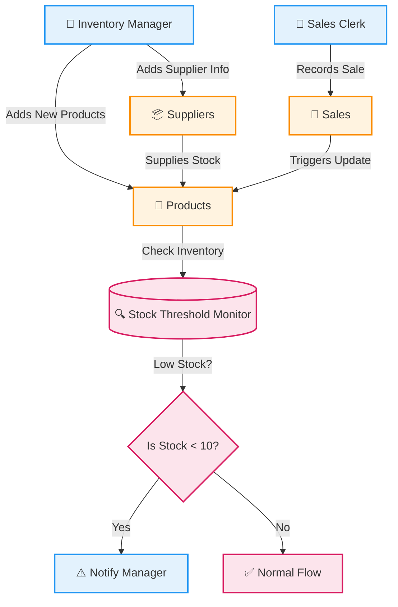

# 🎓 PL/SQL FINAL EXAM

## 👤 Identification
- **Name:** Habimana Cedrick  
- **Student ID:** 27443  
- **Project Title:** Small Retail Inventory System  
- **Course:** INSY 8311 - Database Development with PL/SQL  
- **Academic Year:** 2024-2025  
- **Lecturer:** Eric Maniraguha (eric.maniraguha@auca.ac.rw)  

---

## 🚀 Phase I: Problem Statement & Presentation

### 📌 Objective
To identify a real-world issue that requires a **PL/SQL-based Oracle database solution**. The system must involve multiple entities and complex logic suitable for database development and procedural programming.

---

## 💡 Project Summary: Small Retail Inventory System

### 📖 Problem Definition
Small retail stores often struggle with manual inventory tracking. This leads to:
- Overstocking or stockouts
- Inefficiency in restocking
- Inaccurate sales reporting

### 🌍 Context
The system will be deployed in:
- Small grocery stores
- Corner shops
- Local retail stores

It will help automate the management of product stock, sales tracking, and supplier coordination.

### 🎯 Target Users
- Small retail store owners
- Cashiers and shop managers

### 🏆 Project Goals
- 🛒 Automate inventory tracking  
- 📊 Monitor real-time stock levels and sales  
- 🔔 Alert users for low stock  
- 📦 Track suppliers and streamline restocking  
- 📈 Improve overall business operation accuracy  

---

## 🧩 Key Database Entities

| Entity             | Attributes                                                                 |
|--------------------|----------------------------------------------------------------------------|
| **Products**        | `Product_ID`, `P_Name`, `Price`, `Quantity`, `Created_At`                 |
| **Sales**           | `Sale_ID`, `Product_ID`, `Date`, `Quantity_Sold`                           |
| **Suppliers**       | `Supplier_ID`, `Name`, `Contact`, `Created_At`                       |
| **Supplier_Product**| `Supplier_ID`, `Product_ID`, `Supply_Date`                                 |

### 🔗 Relationships
- A **Supplier** can supply **many Products** (M:N)  
- A **Product** can be involved in **many Sales** (1:N)  

---

## 💎 System Benefits
✅ Reduces human errors in stock counting  
✅ Sends low stock alerts automatically  
✅ Tracks supplier-product links for easy replenishment  
✅ Enhances record accuracy with real-time sales logging  
✅ Improves decision-making with reliable inventory data  

---

---

---
---
