```mermaid
flowchart TD
  A[🧍 Inventory Manager] -->|Adds Supplier Info| B[📦 Suppliers]
  A -->|Adds New Products| C[🛒 Products]
  B -->|Supplies Stock| C
  D[🧾 Sales Clerk] -->|Records Sale| E[🧾 Sales]
  E -->|Triggers Update| C
  C -->|Check Inventory| F[(🔍 Stock Threshold Monitor)]
  F -->|Low Stock?| G{Is Stock < 10?}
  G -- Yes --> H[⚠️ Notify Manager]
  G -- No --> I[✅ Normal Flow]

  classDef actor fill:#e3f2fd,stroke:#2196f3,stroke-width:2px;
  classDef data fill:#fff3e0,stroke:#fb8c00,stroke-width:2px;
  classDef system fill:#fce4ec,stroke:#d81b60,stroke-width:2px;

  class A,D,H actor
  class B,C,E data
  class F,G,I system
```

# 🎓 PL/SQL FINAL EXAM

## 👤 Identification
- **Name:** Habimana Cedrick  
- **Student ID:** 27443  
- **Project Title:** Small Retail Inventory System  
- **Course:** INSY 8311 - Database Development with PL/SQL  
- **Academic Year:** 2024-2025  
- **Lecturer:** Eric Maniraguha (eric.maniraguha@auca.ac.rw)  

---

## 🚀 Phase I: Problem Statement & Presentation

### 📌 Objective
To identify a real-world issue that requires a **PL/SQL-based Oracle database solution**. The system must involve multiple entities and complex logic suitable for database development and procedural programming.

---

## 💡 Project Summary: Small Retail Inventory System

### 📖 Problem Definition
Small retail stores often struggle with manual inventory tracking. This leads to:
- Overstocking or stockouts
- Inefficiency in restocking
- Inaccurate sales reporting

### 🌍 Context
The system will be deployed in:
- Small grocery stores
- Corner shops
- Local retail stores

It will help automate the management of product stock, sales tracking, and supplier coordination.

### 🎯 Target Users
- Small retail store owners
- Cashiers and shop managers

### 🏆 Project Goals
- 🛒 Automate inventory tracking  
- 📊 Monitor real-time stock levels and sales  
- 🔔 Alert users for low stock  
- 📦 Track suppliers and streamline restocking  
- 📈 Improve overall business operation accuracy  

---

## 🧩 Key Database Entities

| Entity             | Attributes                                                                 |
|--------------------|----------------------------------------------------------------------------|
| **Products**        | `Product_ID`, `P_Name`, `Price`, `Quantity`, `Created_At`                 |
| **Sales**           | `Sale_ID`, `Product_ID`, `Date`, `Quantity_Sold`                           |
| **Suppliers**       | `Supplier_ID`, `Name`, `Contact`, `Created_At`                       |
| **Supplier_Product**| `Supplier_ID`, `Product_ID`, `Supply_Date`                                 |

### 🔗 Relationships
- A **Supplier** can supply **many Products** (M:N)  
- A **Product** can be involved in **many Sales** (1:N)  

---

## 💎 System Benefits
✅ Reduces human errors in stock counting  
✅ Sends low stock alerts automatically  
✅ Tracks supplier-product links for easy replenishment  
✅ Enhances record accuracy with real-time sales logging  
✅ Improves decision-making with reliable inventory data  

---

---
## 📘 Phase II: Business Process Modeling (MIS)
### 🔍 Scope & Purpose
This phase models the **inventory workflow** from stock monitoring to sales and low-stock alerting. It demonstrates how an **MIS supports decision-making** through automation and accurate data flow.

### 👥 Key Actors

| Role               | Responsibility                             |
|--------------------|---------------------------------------------|
| Inventory Manager  | Monitors stock and updates inventory        |
| Supplier           | Delivers products                           |
| Sales Clerk        | Records sales                               |
| Inventory System   | Maintains stock data, evaluates thresholds  |
| Alert System       | Notifies when stock is low                  |

---

### 🖼️ Process Diagram

✅ **Tools Used:**  
- **Mermaid** (Lightweight Markdown-based modeling)  
- **Draw.io** (Standard BPMN format)  

#### 🔗 Mermaid Diagram  

---

#### 🧩 Draw.io BPMN Diagram  

---

### 🧠 MIS Value & Flow Summary
The diagram starts with the **Inventory Manager** monitoring stock. When a product is low, they receive deliveries from the **Supplier**. The system is then updated. When a **Sales Clerk** records a sale, the inventory is updated again. After each update, the **Inventory System** evaluates whether the stock has fallen below the set threshold. If so, the **Alert System** automatically notifies the manager for restocking.  

This workflow supports MIS by:
- Enabling **real-time decision-making**  
- Reducing **manual effort** through automation  
- **Improving efficiency** in retail operations  

---

### 💻 Mermaid Code Reference

```mermaid
flowchart TD
  start([● Process Start]) --> A1["🧑 Inventory Manager\nMonitor Stock Levels"]
  A1 --> A2["📦 Receive Products"]
  A2 --> B1["🚚 Supplier Delivery"]
  B1 --> C1["🧾 Record Sale"]
  C1 --> A3["📊 Update Inventory"]
  A2 --> A3
  A3 --> D1{{"🔍 Stock < Threshold?"}}
  D1 -- Yes --> E1["❗ Send Alert"]
  D1 -- No --> finish([✅ Process End])
  E1 --> finish

  classDef manager fill:#f9f,stroke:#333;
  classDef supplier fill:#bbf,stroke:#333;
  classDef clerk fill:#9f9,stroke:#333;
  classDef system fill:#f96,stroke:#333;

  class A1,A2,A3 manager
  class B1 supplier
  class C1 clerk
  class D1,E1 system
```

---

